## 📊 ERD (Entity Relationship Diagram)

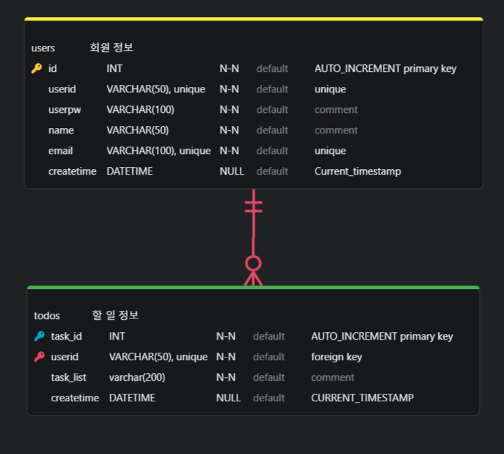

# API 테스트 결과

## 📸 회원가입 API

- **테스트 결과:**
  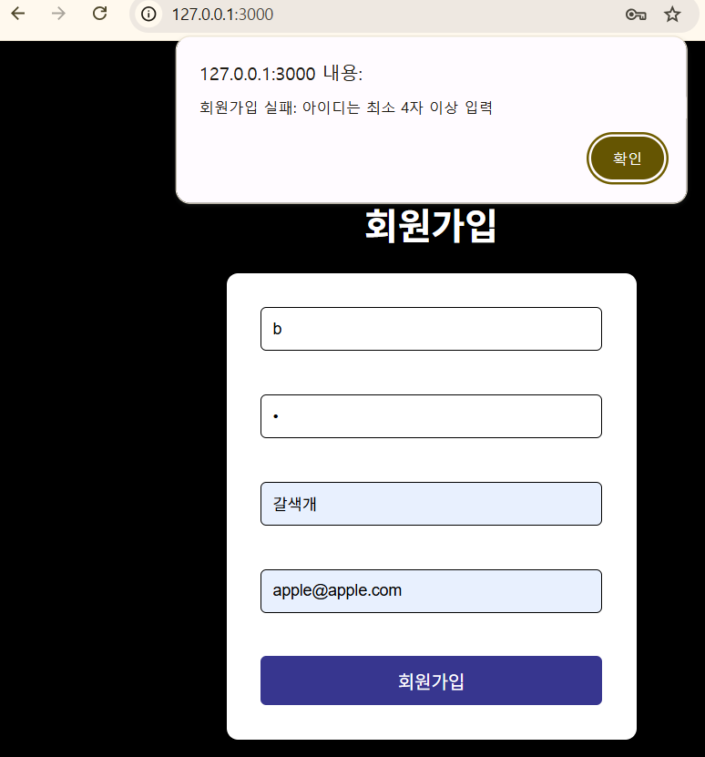
  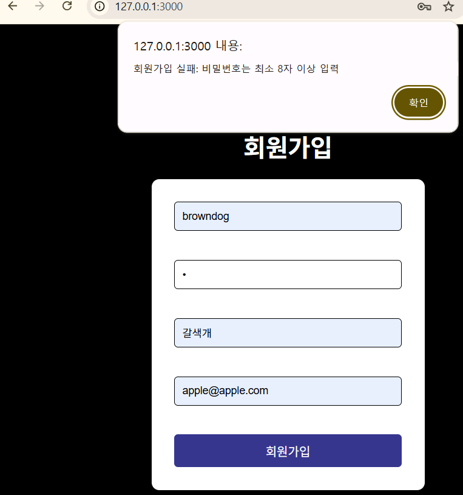
  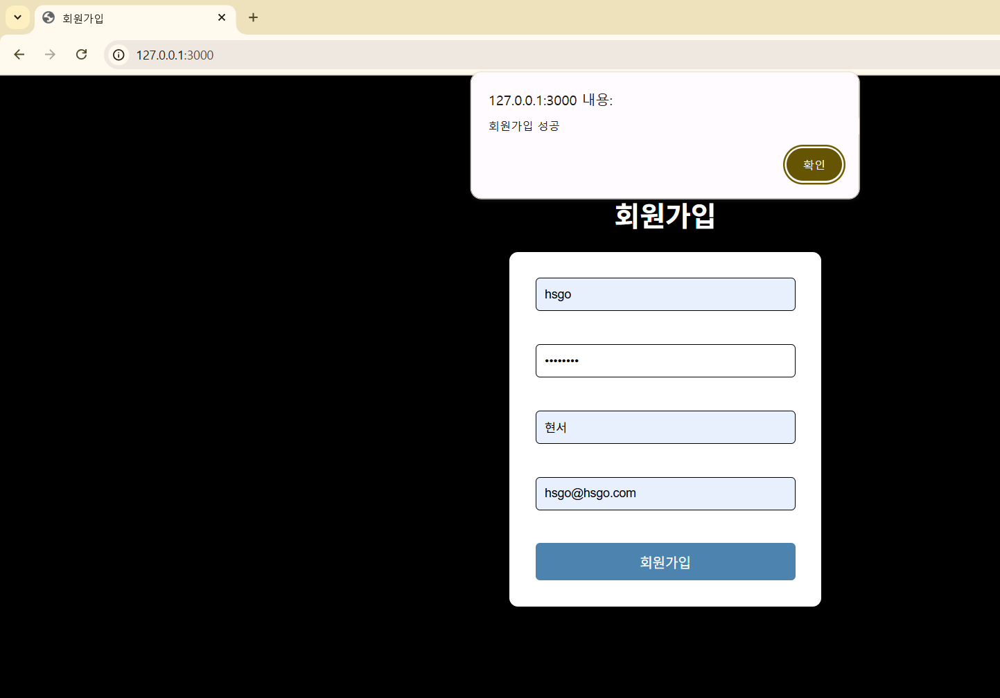

## 📸 로그인 API

- **테스트 결과:**
  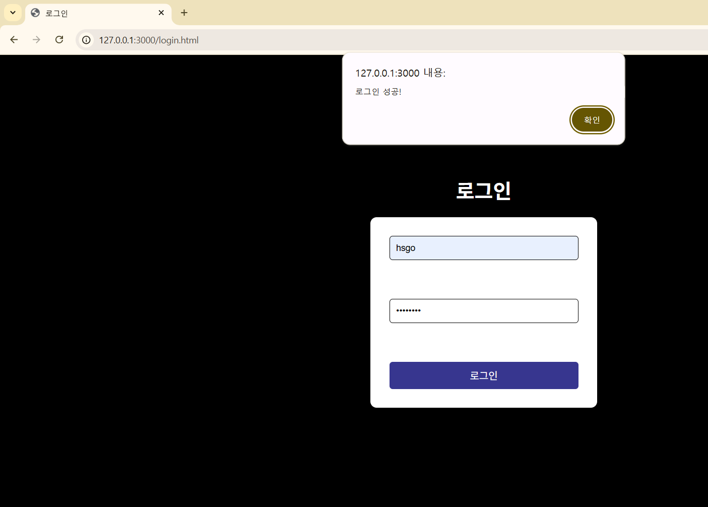

### 📸 `users` 테이블에 사용자 추가

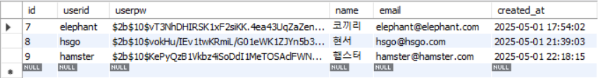

## 📸 나의 할 일 API

### (1) 나의 할 일 페이지 & 콘솔창에 토큰

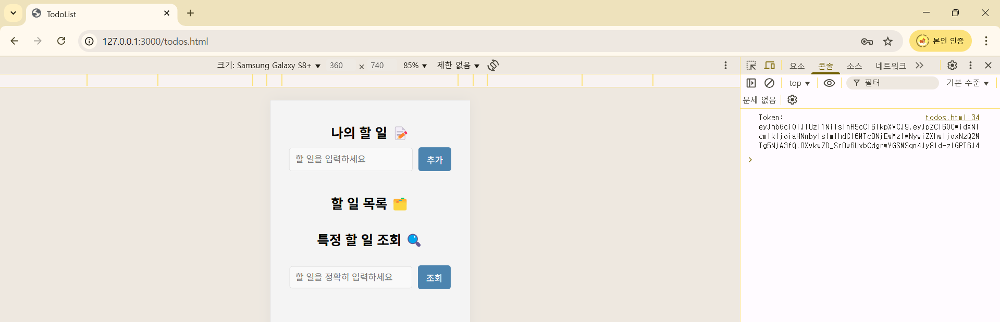

### (2) 할 일 추가

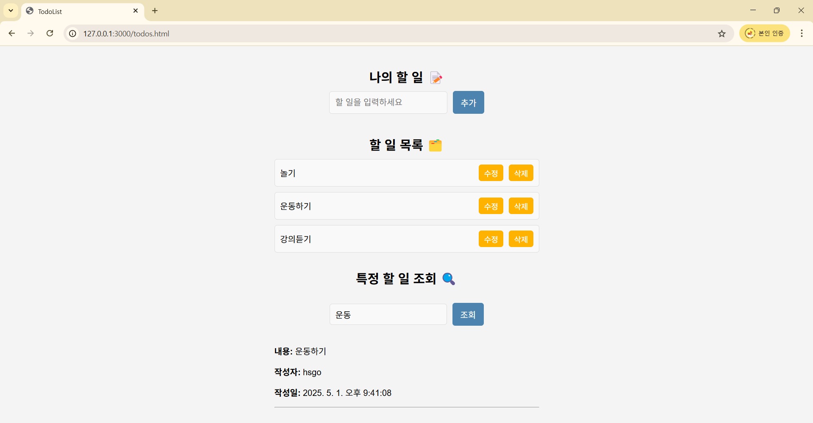

### (3) 할 일 수정

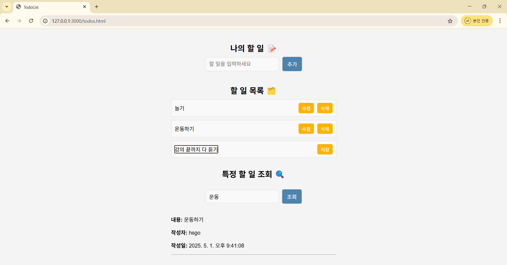

### (4) 할 일 저장

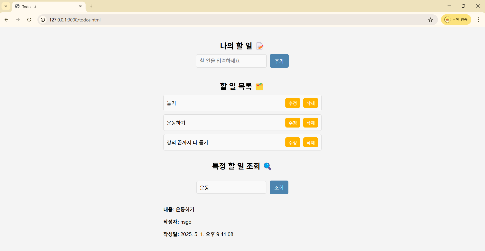

### (5) 할 일 삭제

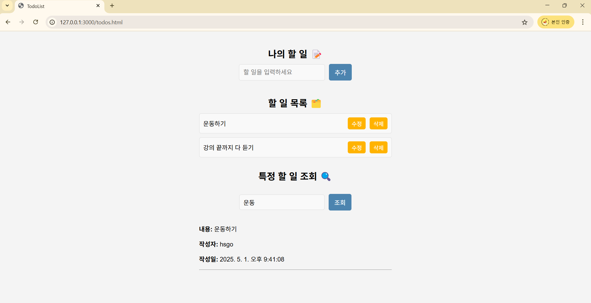

### (6) 할 일 검색

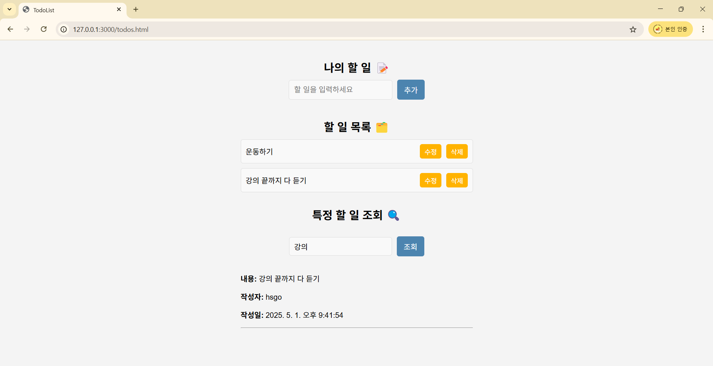

### 2. `todos` 테이블에 할 일 추가

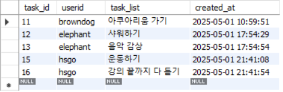
